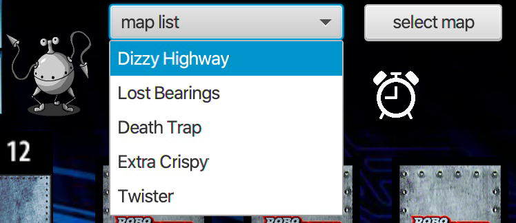
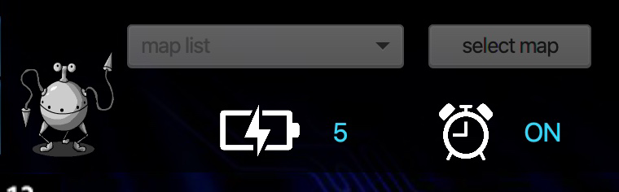

# Welcome to RoboRally!
This is our University project for the board game RoboRally.

## The Game
It was a hard day on the planet. Widget manufacturing computer RSL973, or “Russel” for short, was a bit behind on his widget quota, and the other computers had taunted him for it. He had hoped to get back at them in a RoboRallyTM game, but things weren't going well for him in that either. Just this last turn, Russel’s racing robot had been severely damaged and one of its program registers was stuck. According to the laws of the race, the central race computer would give Russel only four instructions. Not much, Russel thought. And what poor instructions they were! Russel quickly realized there was no way he could program his robot to reach the repair site.

But wait — what was this? From deep in the back of Russel’s “mind,” his strategic subroutines suggested an alternative ploy: Russel had a slim chance of reaching the repair site this turn if he could get one of his opponents to push him. In a race, robots usually push each other as an offensive maneuver; a robot knocked off course might accidentally fall into a pit. By putting his robot in position to benefit from a push just might keep Russel in the race and earn him the respect of his peer control computers. Russel [downloaded](http://media.wizards.com/2017/rules/roborally_rules.pdf) the instructions into his racing robot. He was back in the race!

### Start the game
First, please download the project or .JAR files to your local machine. Then, in order to start the game, make sure you have a running server (.JAR File in Folder 'Server') and then start the Client (.JAR File in Folder 'Client').
Note that for every additional Player, you have to start another Client Instance.

### Gameplay
Start by Clicking on an Icon representing the Robot you want to choose and enter your Name. If you can't click on the Icon, the Robot is already taken.

   

Now you can see which Robots are also online and maybe even ready for a match:

   

If you want, you can write them a nice message! Just click on the drop down menu to choose either all or one certain Robot.

   

Then you can write the message and hit the Send Button

   

If you are brave enough for the game, just hit the button and let's go!

   

The first Robot to enter the game, can choose the map - Dizzy Highway is a great choice for beginners!

   

By clicking on the gears on the start board, you can set your start position.

  
If you can afford it, you can buy some upgrades in the Upgrade Shop:

   

If you choose Admin Privilege, don't forget to set the Register you want to get Priority in!

   

And now you can see your hand cards! Drag the Cards to the desired register and let it drop. But choose wisely ...

   

Fill the whole register with cards...

   

and after that, just hit the finish button.

   

Now you are all set up and play the first round!

   

Always keep an eye on your Energy and the Timer...

    

And don't worry if something goes wrong! Just prove that you are a Robot and keep playing ;)

   

Whenever you are confused or don't know what's going on, have a look at the top: there is a small info screen with the most important information

Have fun!

#### Requirements: Please read carefully!
In order to run the Game without problems, you'll need to install Java to run the .JAR File
Also in order for the Log Files to be created, please start the .JAR File in the following way from your terminal:

java -jar clevere-cousins.jar

# Zusätzliche Dokumentation für die finale Abgabe

Auf unserer [Wiki page](/%2E%2E/wikis/home) findet ihr die folgenden relevanten Informationen:

- [Protokoll aller Tutorentreffen](/%2E%2E/wikis/Tutorentreffen)
- [Präsentation des Projekts](/%2E%2E/wikis/Präsentation-des-Projekts)
- [Konzept der Künstlichen Intelligenz](/%2E%2E/wikis/Künstliche%20Intelligenz%20in%20Robo%20Rally)
- [UML Diagramm](/%2E%2E/wikis/Tutorentreffen)
- [JavaDocs](../Abgabe/JavaDocs)
- [Source Code](../Abgabe/src)

...

Und vieles Mehr!
